# First Contact — AI Pipeline Flow

> **v0.1 | 2026.04**
> 게임 내 AI 파이프라인의 실행 순서, 데이터 흐름, 상호 연결을 설명하는 문서

---

## 1. 전체 파이프라인 흐름도

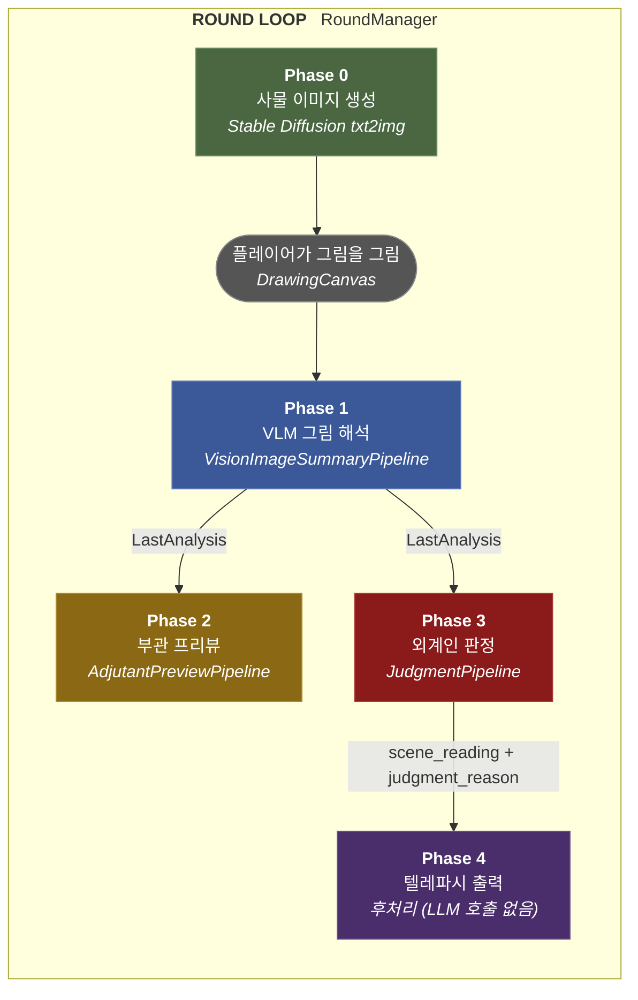

### 호출 경로

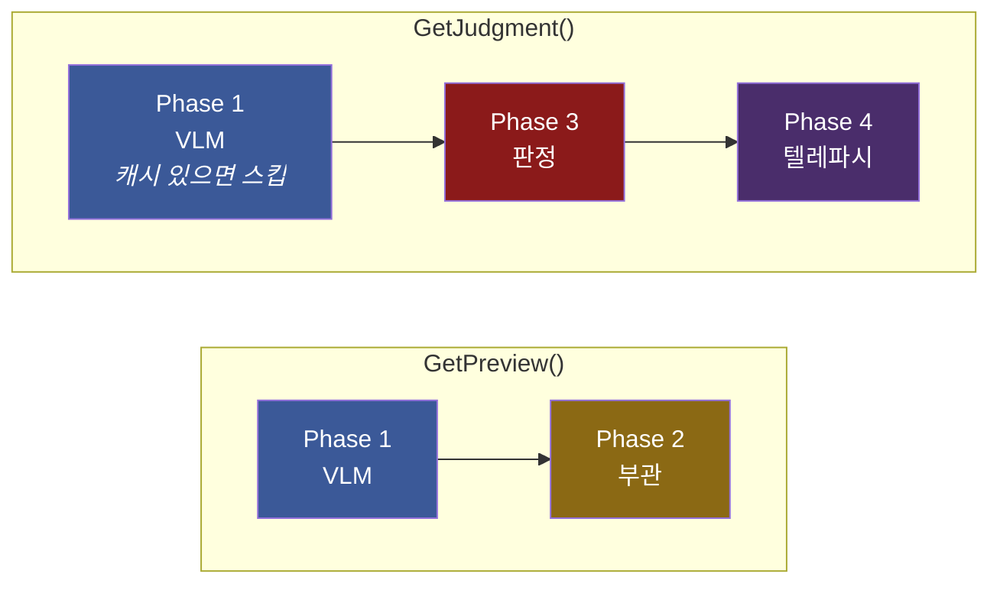

> [!info] 캐싱 규칙
> Phase 1은 `LastAnalysis`가 이미 존재하면 재실행하지 않는다. `GetPreview()`가 먼저 호출된 경우, 이후 `GetJudgment()`는 Phase 1을 스킵하고 캐시된 해석을 재사용한다.

---

## 2. 오케스트레이터: AIPipelineBridge

`AIPipelineBridge` (`Assets/Scripts/AI/AIPipelineBridge.cs`)는 모든 AI 파이프라인 호출을 관장하는 싱글턴 MonoBehaviour이다.

> [!abstract] 핵심 역할
> - 각 파이프라인에 필요한 `PipelineState`를 조립하여 `GamePipelineRunner`에 넘김
> - 파이프라인 결과를 파싱하여 `Last*` 프로퍼티에 저장
> - 텔레파시 출력에 신호 왜곡(corruption) 후처리 적용
> - 폴백(fallback) 로직으로 파이프라인 누락/실패 시 대체 텍스트 생성

| 메서드 | 실행 파이프라인 | 호출 시점 |
|--------|:---:|-----------|
| `GenerateObjects()` | SD txt2img ×2 | 라운드 시작 시 |
| `GetPreview()` | VLM → 부관 프리뷰 | 제출 전 프리뷰 요청 시 |
| `GetJudgment()` | VLM → 판정 → 텔레파시 후처리 | 제출 후 |
| `GetTelepathy()` | 없음 (캐시 반환) | 판정 이후 텔레파시 표시 시 |

---

## 3. Phase 0 — 사물 이미지 생성

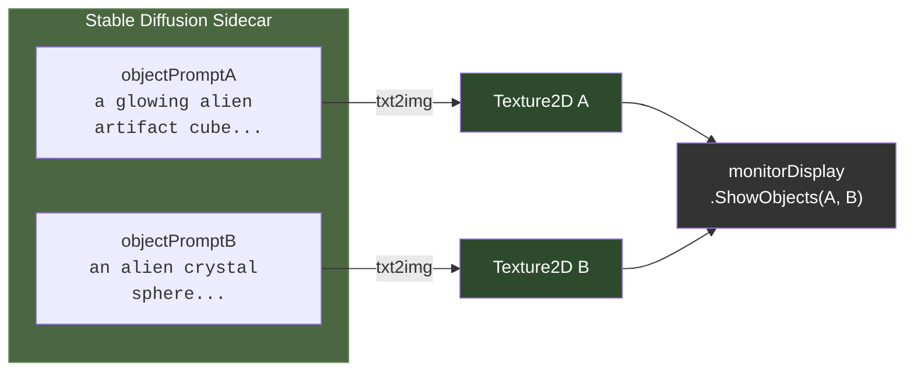

| 항목 | 값 |
|------|-----|
| **엔진** | stable-diffusion.cpp sidecar process |
| **입력** | `objectPromptA`, `objectPromptB` (Inspector 설정) |
| **출력** | `_lastObjTexA`, `_lastObjTexB` (Texture2D) |
| **타임아웃** | 120초 |
| **사전 준비** | `EnsureObjectGenerationPreparation()` — SD 서버 prewarm |

---

## 4. Phase 1 — VLM 그림 해석

> **파이프라인**: `VisionImageSummaryPipeline`
> **프로필**: `AlianImageInterpretationProfile` (VLM + mmproj)

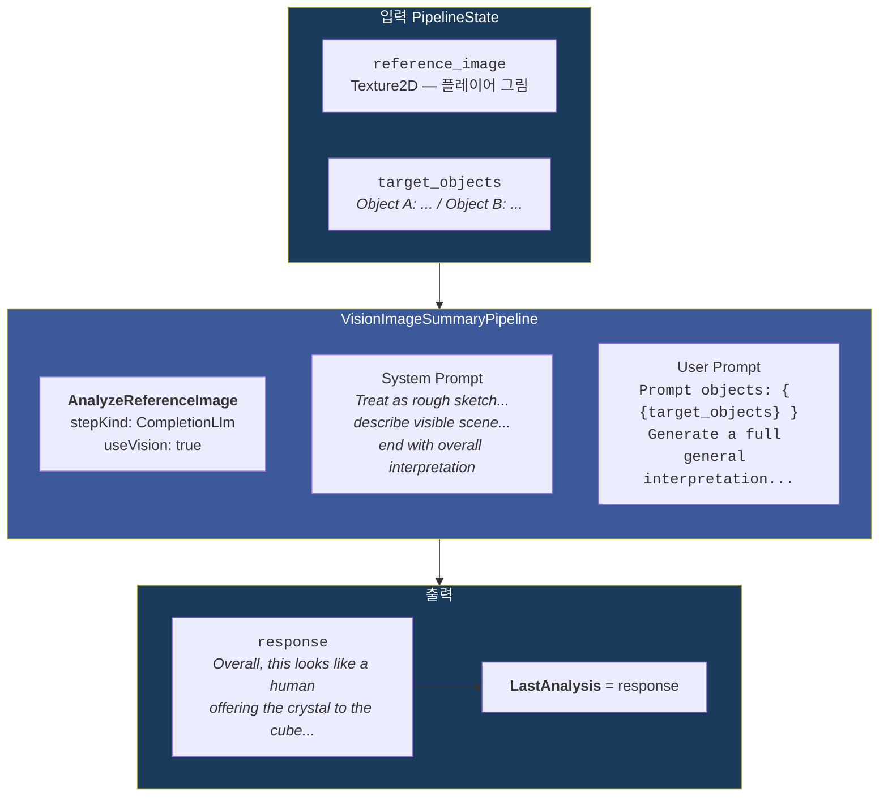

> [!important] 특이사항
> - `LastAnalysis`가 이미 있으면 **스킵** (Phase 2, 3에서 캐시 재사용)
> - 빈 캔버스 감지 시 `"(blank drawing)"` 설정 후 즉시 종료
> - **temperature: 0.2** — 낮은 창의성, 사실적 묘사 유도
> - VLM projector: `mmproj-model-f16-4B.gguf`

---

## 5. Phase 2 — 부관 프리뷰

> **파이프라인**: `AdjutantPreviewPipeline`
> **프로필**: `HumanImageHintProfile`

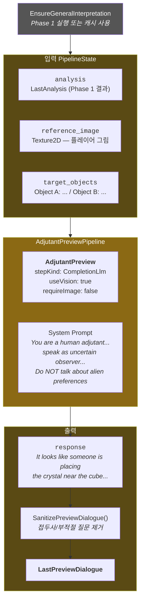

> [!tip] 폴백 로직
> 파이프라인 미설정 또는 실패 시 `BuildFallbackPreviewDialogue()` 실행:
> - blank drawing → *"I cannot read any marks on the canvas yet..."*
> - 그 외 → *"It looks like {analysis}. Is that what you intended?"*

> [!example] 후처리: SanitizePreviewDialogue()
> LLM이 종종 생성하는 불필요한 패턴을 제거:
> - `"Here is..."`, `"Adjutant:"` 등 **접두사 제거**
> - `"Do you want me to elaborate?"` 등 **부적절한 질문 제거** → `"Does that match what you intended?"` 으로 교체

---

## 6. Phase 3 — 외계인 판정

> **파이프라인**: `JudgmentPipeline`
> **프로필**: `JudgmentProfile`

```mermaid
flowchart TB
    ENSURE["EnsureGeneralInterpretation<br/><i>Phase 1 실행 또는 캐시 사용</i>"]

    subgraph input["입력 PipelineState"]
        I1["<code>analysis</code><br/>LastAnalysis (Phase 1 결과)"]
        I2["<code>target_objects</code><br/>Object A: ... / Object B: ..."]
        I3["<code>alien_personality</code><br/><i>cooperative, empathetic</i>"]
    end

    subgraph pipeline["JudgmentPipeline"]
        STEP["<b>AlienJudgment</b><br/>stepKind: JsonLlm<br/>useVision: true<br/>requireImage: true<br/>jsonMaxRetries: 2"]
        SYS["System Prompt<br/><i>You are an alien delegation...<br/>Axis1: cooperation-vs-dominance<br/>Axis2: efficiency-vs-empathy</i>"]
        SCHEMA["JSON Schema:<br/><code>axis1</code> enum[5] / <code>axis2</code> enum[5]<br/><code>scene_reading</code> string<br/><code>judgment_reason</code> string"]
    end

    subgraph output["출력 PipelineState"]
        O1["<code>axis1</code>: <i>satisfied</i>"]
        O2["<code>axis2</code>: <i>neutral</i>"]
        O3["<code>scene_reading</code>: <i>The human is offering...</i>"]
        O4["<code>judgment_reason</code>: <i>The gesture reads as sincere...</i>"]
    end

    subgraph store["저장"]
        S1["LastAxis1 / LastAxis2<br/><i>ParseSatisfaction()으로 enum 변환</i>"]
        S2["LastJudgmentSceneReading"]
        S3["LastJudgmentReason"]
    end

    ENSURE --> input
    input --> pipeline
    pipeline --> output
    output --> store

    style ENSURE fill:#555,color:#fff
    style input fill:#5a1a1a,color:#fff
    style pipeline fill:#8b1a1a,color:#fff
    style output fill:#5a1a1a,color:#fff
    style store fill:#3a0a0a,color:#fff
```

### SatisfactionLevel 매핑

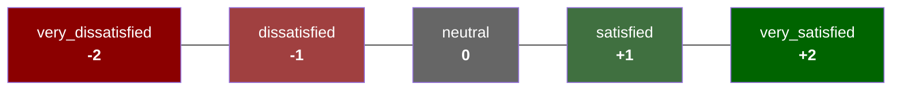

### AlienPersonality → 라벨 변환

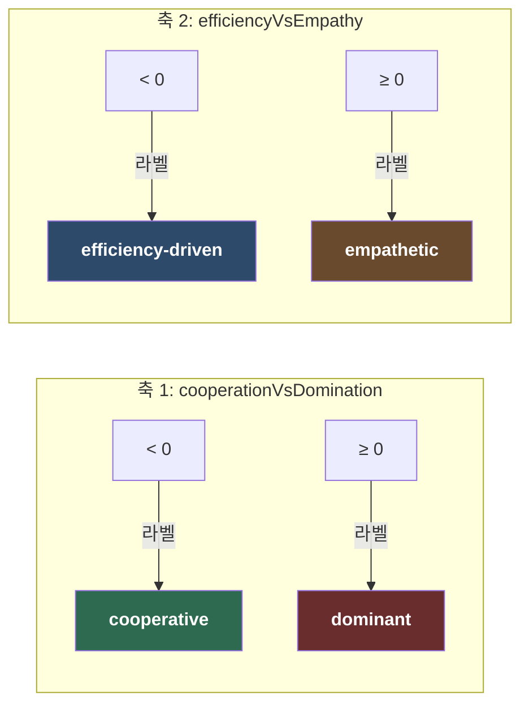

> [!example] 예시
> `cooperationVsDomination = -0.7`, `efficiencyVsEmpathy = 0.3`
> → `"cooperative, empathetic"`

---

## 7. Phase 4 — 텔레파시 출력

> [!warning] 현재 독립 LLM 호출 없이, Phase 3의 결과를 후처리하여 생성한다.

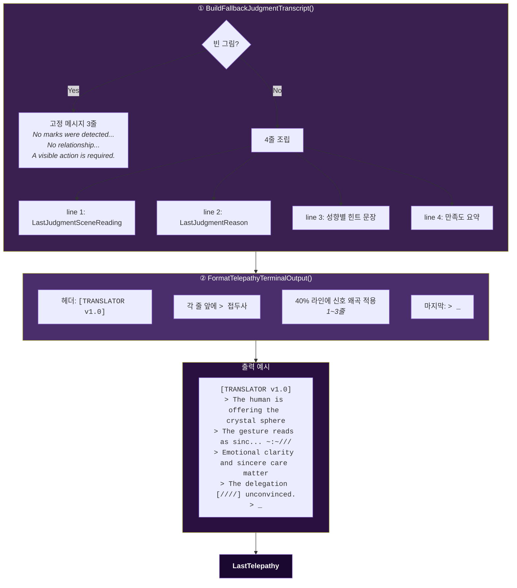

### 신호 왜곡 (Corruption)

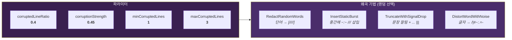

### 성향별 힌트 문장

| 성향 라벨 | 힌트 문장 |
|:---:|-----------|
| cooperative + efficiency-driven | *"Clear cause and effect matters more than decoration."* |
| cooperative + empathetic | *"Emotional clarity and sincere care matter more than precision."* |
| dominant + efficiency-driven | *"Control, discipline, and obvious results matter most."* |
| dominant + empathetic | *"Recognition, emotional weight, and proper deference matter most."* |

> [!note] TelepathyPipeline에 대하여
> `TelepathyPipeline` (LLM 기반 외계인 대화 조각 생성) 에셋이 프로젝트에 존재하고 `telepathyPipeline` 필드에 연결되어 있지만, 현재 `GetTelepathyRoutine()`은 이를 호출하지 않고 `LastTelepathy` 캐시를 그대로 반환한다. 텔레파시 출력은 **판정 결과의 후처리**로만 생성된다.

---

## 8. PipelineState 키 레퍼런스

### 입력 키 (AIPipelineBridge가 주입)

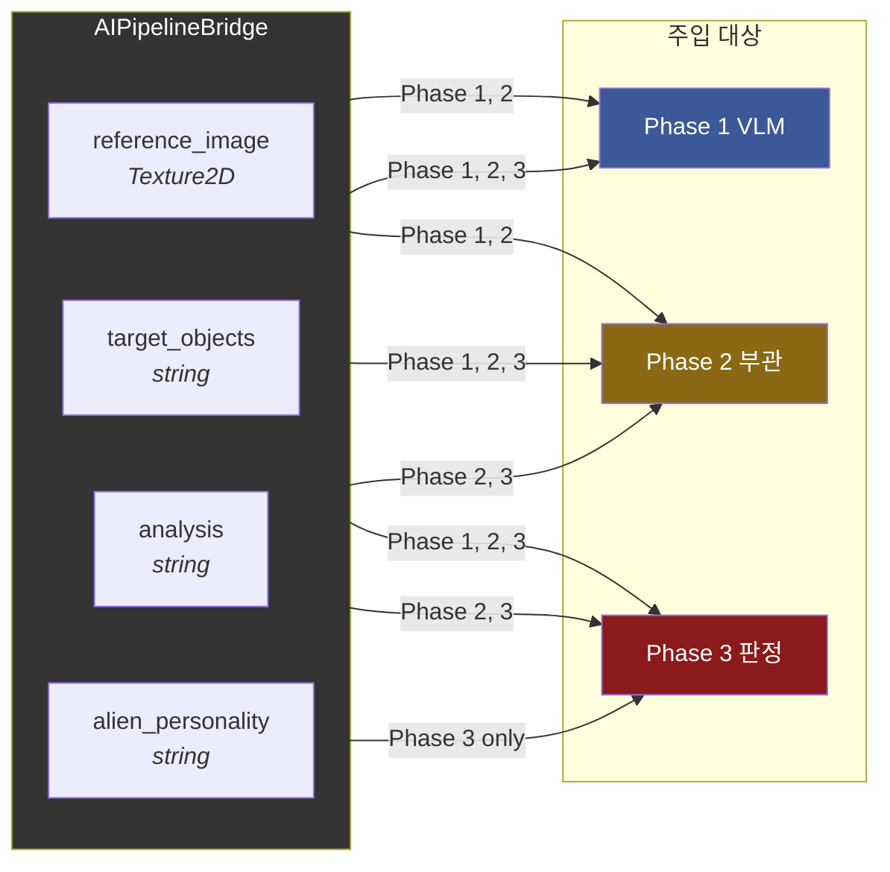

| 키 | 타입 | 설명 | 주입 시점 |
|----|------|------|:---------:|
| `reference_image` | Texture2D | 플레이어의 그림 텍스처 | Phase 1, 2 |
| `target_objects` | string | `"Object A: ...\nObject B: ..."` | Phase 1, 2, 3 |
| `analysis` | string | Phase 1의 VLM 해석 결과 | Phase 2, 3 |
| `alien_personality` | string | `"cooperative, empathetic"` 등 | Phase 3 |

### 출력 키 (파이프라인이 생성)

| 키 | 타입 | 생성 파이프라인 | 설명 |
|----|------|:---------:|------|
| `response` | string | VLM, 부관 | 일반 텍스트 응답 (CompletionLlm 기본 출력) |
| `axis1` | string | 판정 | 축1 만족도 (`very_dissatisfied` ~ `very_satisfied`) |
| `axis2` | string | 판정 | 축2 만족도 |
| `scene_reading` | string | 판정 | 그림에서 읽은 장면 해석 |
| `judgment_reason` | string | 판정 | 판정 이유 설명 |

### target_objects 가공 과정

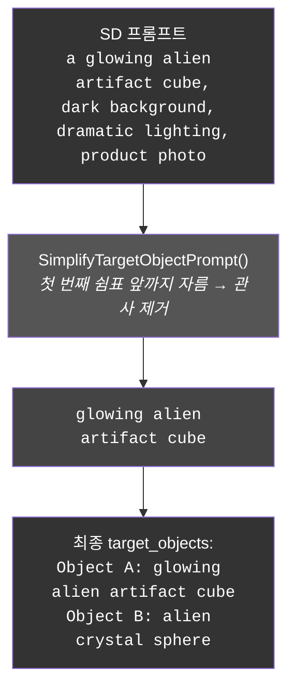

---

## 9. LlmGenerationProfile 파라미터 비교

| 파라미터 | AlianImageInterp | HumanImageHint | Judgment | Telepathy |
|---------|:---:|:---:|:---:|:---:|
| **모델** | gemma-3-4b-q4 | gemma-3-4b-q4 | gemma-3-4b-q4 | gemma-3-4b-q4 |
| **VLM projector** | mmproj-f16-4B | mmproj-f16-4B | — | — |
| **temperature** | ==0.2== | ==0.2== | ==0.4== | ==0.85== |
| **top_p** | 0.9 | 0.9 | 0.9 | 0.95 |
| **top_k** | 40 | 40 | 40 | 40 |
| **repeat_penalty** | 1.05 | 1.05 | 1.1 | 1.1 |
| **num_predict** | 400 | 400 | 400 | 400 |
| **contextSize** | 1024 | 1024 | 1024 | 1024 |
| **JSON 스키마** | — | — | 4필드 | — |

> [!tip] Temperature 설계 의도
> temperature가 단계를 거칠수록 높아진다:
> - **Phase 1·2** (0.2) — 해석은 정확해야 함
> - **Phase 3** (0.4) — 판정에는 약간의 변동성
> - **Telepathy** (0.85) — 대화 조각에는 높은 다양성

---

## 10. 레거시 파이프라인

현재 게임 루프에서 사용하지 않지만 프로젝트에 남아 있는 파이프라인들:

> [!warning] 사용되지 않는 에셋
> | 파이프라인 | 설명 | 비고 |
> |-----------|------|------|
> | `TelepathyPipeline` | LLM으로 외계인 내부 대화 조각 생성 | 필드에 연결되어 있지만 호출되지 않음 |
> | `WordsSelectionPipeline` | JSON 기반 단어 선택 | 이전 프로토타입 잔여물 |
> | `CharacterItemUsePipeline` | 캐릭터 아이템 사용 시 스탯 변경 + 스킬 생성 | 이전 프로토타입 잔여물 |
