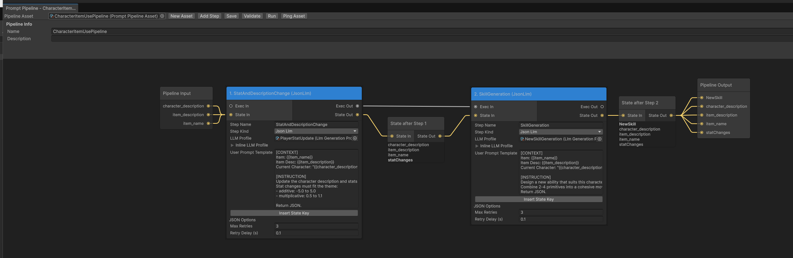
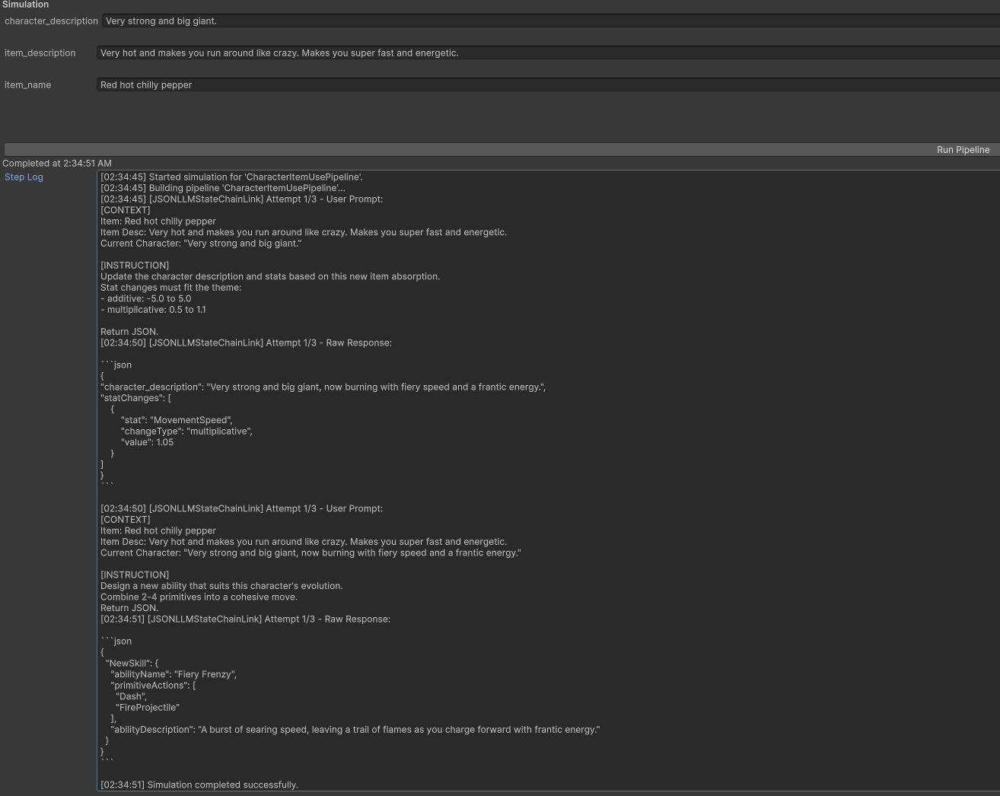

# Unity LLM Pipeline (LLamaSharp + GGUF)

A Unity-focused local LLM pipeline toolkit for generating structured gameplay data from in-scene state.

This project includes:
- Local GGUF inference runtime (`LLamaSharp`)
- Stateful prompt pipeline execution
- JSON schema-guided output and retry flow
- Unity editor tools for dependency/backend setup and packaging
- A gameplay demo: adaptive stat + skill evolution from absorbed items

### Pipeline editor example pictures
#### Node based pipeline editor that defines the data processing flow using LLM.

#### You can also simulate the pipeline in the editor with example input.

## Demo Media

### Demo Video
#### What it does
- The defined LLM pipeline takes the player stat and Item desctiption data as context
- Evaluates how the Item will affect the player stats 
- Generates a new skill that matches the item effect and player stat by combining the pre-defined skill effects in order that makes the most sense and give name and description to the new skill.

[Watch demo video (Google Drive)](https://drive.google.com/file/d/1lVmrjelVQk4QazHObGEMpEyvTqLnsWqG/view?usp=sharing)

## Setup Instructions

1. Import this package/project content into your Unity project.
2. Open `Tools > LLM Pipeline > Setup Wizard`.
3. Click `Use Recommended`.
4. Click `Install/Update Dependencies`.
5. Click `Apply Backend Configuration`.
6. Put a GGUF model in `Assets/StreamingAssets/Models/`.
7. In Setup Wizard, apply that model to all `LlmGenerationProfile` assets.
8. Open the sample scene included in the demo and press Play.

## What The Demo Does

1. Player absorbs an item.
2. Gameplay context is converted into pipeline state.
3. Pipeline generates structured JSON for evolved stats and skill composition.
4. Gameplay systems apply the results in real time.

## Documentation

Main docs are under `Docs/`.

Recommended order:
1. `Docs/PackageOverview.md`
2. `Docs/Tutorial.html`
3. `Docs/QuickStart.md`
4. `Docs/PipelineEditorGuide.md`
5. `Docs/Troubleshooting.md`

## Practical Requirements

- Unity project with compatible editor/runtime settings
- NuGetForUnity (Setup Wizard can install it)
- One backend package matching machine capability (`CPU`, `CUDA12`, `Vulkan`, or `Metal`)
- One GGUF model file

## Notes

- Do not enable multiple backend native plugin variants for Editor at the same time.
- For Input System-only projects, use compatibility input wrapper scripts in the demo.
- For intended sample visuals, confirm URP/2D renderer setup.

## Third-Party Notices

See `Docs/ThirdPartyNotices.md`.
